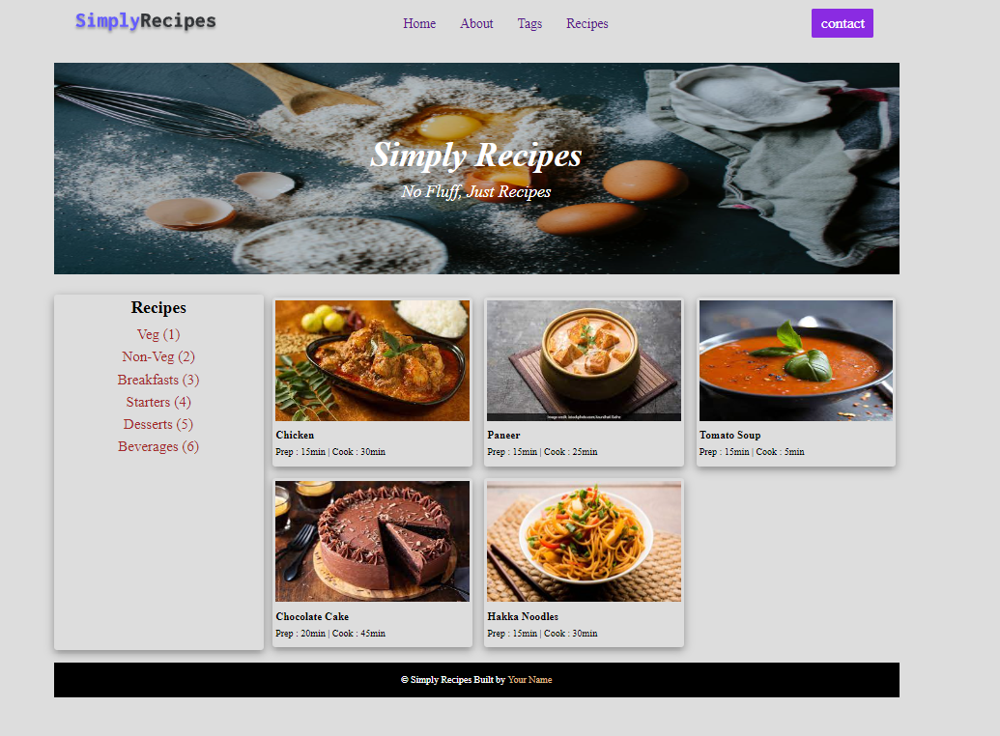
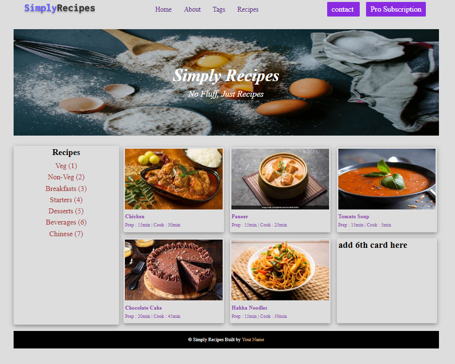

 # DOM ASSIGNMENT #

 ## 5<sup>th</sup> Assignment ##
**Intial Look of website**
 


- The Task is to performa the following given task
 
- 1-> Add pro subscription button next to the contact
- 2-> Add chinese in the Recipes section
- 3-> change the color of the card text form black to #8D3DAF
- 4-> change Add the new card inside the recipe-gallery class


**Output**



**Code**

``` javascript
     const navbar =document.querySelector(".nav-center div:nth-of-type(3)")
   // console.log(navbar);
    const btn=document.createElement("a")
    btn.className="btn"
    btn.textContent="Pro Subscription"
    navbar.appendChild(btn)
     
 ```

 

**Code**

``` javascript
    const recipe=document.querySelector(".tags-container div:nth-of-type(1)")
    // console.log(recipe);
    const food=document.createElement("a")
    food.textContent="Chinese (7)"
    recipe.appendChild(food)
     
 ```

 

**Code**

``` javascript
     const recipeText = document.querySelectorAll('.recipe-text');
    //  console.log(recipeText);
    for(let i=0; i<recipeText.length ;i++){
        const h5=recipeText[i].querySelector("h5")
        const p=recipeText[i].querySelector("p")
        h5.style.color="#8D3DAF"
        p.style.color="#8D3DAF"
    }
     
 ```

 

**Code**

``` javascript
     const recipeGallery= document.querySelector(".recipe-gallery")
    //console.log(recipeGallery);
    const newCard=document.createElement("div")
    newCard.className="card"
    newCard.textContent="add 6th card here"
    newCard.style.fontWeight="900"
    newCard.style.fontSize="30px"
    recipeGallery.appendChild(newCard)
     
 ```

 


