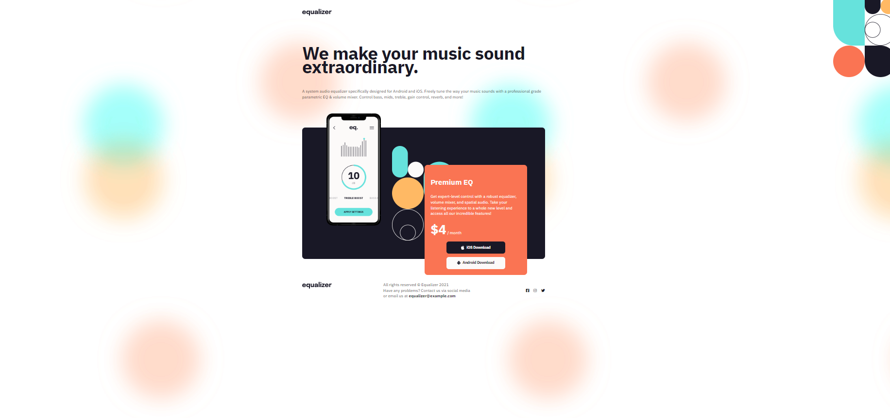
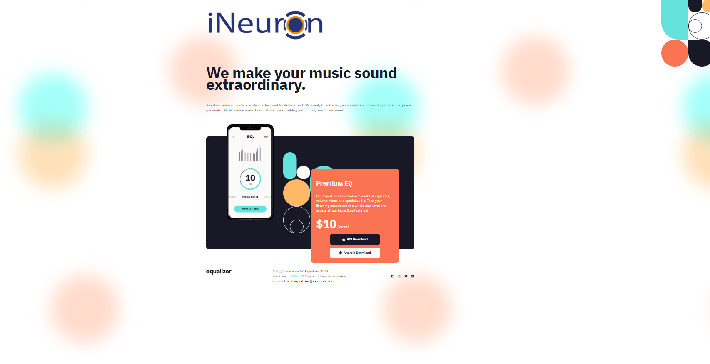

 # DOM ASSIGNMENT #

 ## 6<sup>th</sup> Assignment ##
**Intial Look of website**
 


- The Task is to performa the following given task
 
- 1-> change the equalizer to iNeouron Logo 
- 2-> Changing the pricing of th tag from $4 to $10 
- 3-> Add linkdin icon in the footer


**Output**



**Code**

``` javascript
    const head=document.querySelector("header")
    //console.log(head);
    const logo=head.querySelector("img")
    logo.src="./assets/ineuron-logo.png"
     
 ```


 

**Code**

``` javascript
    const price=document.querySelector(".app_price")
    // console.log(price);
    const span=price.querySelector("span")
    span.textContent="$10"
     
 ```


**Code**

``` javascript
    const footer=document.querySelector(".footer_social")
  
    const div = document.createElement("div")
    div.className="footer_social_ico"
    
    const linkdin=document.createElement("i")
    linkdin.className="fa-brands fa-linkedin"

    div.appendChild(linkdin)
   footer.appendChild(div)
     
 ```
